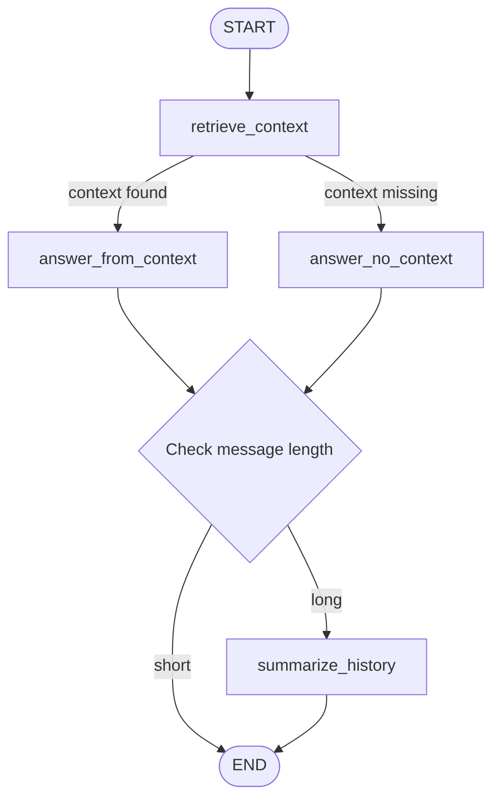

# Transcript Chatbot using LangGraph

A conversational chatbot that answers questions from one or more transcript documents stored as `.docx` files.

The project uses:
- LangGraph for workflow orchestration
- LangChain utilities for loading, splitting, and retrieval
- Bosch text-embedding model for vector retrieval
- ChromaDB (via `langchain-chroma` package) for vector storage and persistent retrieval
- A Bosch OpenAI-compatible API endpoint for answer generation and summarization
- Streamlit for the web UI

---

# Features

- Chat over multiple transcript documents
- Folder-based transcript loading from `transcripts/`
- Retrieval-Augmented Generation (RAG)
- LangGraph-based routing
- Conversation summarization for longer chats
- CLI interface via `main.py`
- Web UI via `app_ui.py`
- Upload `.docx` files directly from the UI
- Source document names shown with retrieved answers
- Retrieved transcript evidence display
- Content-based document deduplication preventing duplicate vectors
- Vector index status display showing newly indexed vs. cached documents
- Persistent ChromaDB storage across sessions

---

## Project Structure

```text
Transcript-Chatbot-/
|-- app/
|   |-- bosch_client.py
|   |-- config.py
|   |-- graph_builder.py
|   |-- loader.py
|   |-- retriever.py
|   |-- utils.py
|-- transcripts/
|   |-- *.docx
|-- app_ui.py
|-- main.py
|-- requirements.txt
|-- README.md
```

---

## How It Works

1. All `.docx` files from the transcripts folder are loaded.
2. The documents are split into smaller chunks.
3. Chunks are converted into vectors using the Bosch embeddings endpoint.
4. Documents are deduplicated based on content hash to prevent storing duplicate vectors.
5. Vectors are stored persistently in ChromaDB for fast retrieval across sessions.
6. For each user question, the most relevant chunks are retrieved via cosine similarity.
7. The source document names for those chunks are preserved.
8. The retrieved context is passed into the Bosch LLM endpoint.
9. LangGraph routes the flow depending on whether relevant context was found.
10. Older chat history is summarized to keep the conversation compact.

---

## LangGraph Flow



---

## Requirements

- Python 3.10+
- Access to the Bosch OpenAI-compatible endpoint
- Valid `GENAIPLATFORM_FARM_SUBSCRIPTION_KEY`
- Network/proxy access if required by your environment

---

## Installation

1. Create and activate your environment.
2. Install dependencies:

```bash
pip install -r requirements.txt
```

---

## Environment Variables

Required:

```env
GENAIPLATFORM_FARM_SUBSCRIPTION_KEY=your_api_key_here
```

Optional:

```env
TRANSCRIPTS_FOLDER=transcripts
CHROMA_PERSIST_DIR=.chroma
CHROMA_COLLECTION_PREFIX=transcript_chatbot
```

Notes:
- If `TRANSCRIPTS_FOLDER` is not set, the app uses `transcripts` by default.
- You can set `TRANSCRIPTS_FOLDER` to any relative or absolute path.

---

## Add Transcript Documents

Place one or more `.docx` transcript files inside the `transcripts/` folder.

Example:

```text
transcripts/
|-- Introduction_to_Data_and_Data_Science.docx
|-- Module_2_Statistics.docx
|-- Module_3_Machine_Learning.docx
```

All of these documents will be loaded and searched together by the chatbot.

---

## Run the CLI Chatbot

```bash
python main.py
```

What it does:
- Loads all transcript files from the transcripts folder
- Builds the retriever
- Starts an interactive terminal chat session

Type `exit` or `quit` to stop.

---

## Run the Streamlit UI

Standard command:

```bash
python -m streamlit run app_ui.py
```

If Streamlit is installed only in your `<env-name>` conda environment, run:

```powershell
& "C:\Users\<NT-ID>\.conda\envs\<env-name>\python.exe" -m streamlit run app_ui.py
```

The Streamlit app provides:
- Chat interface
- Sidebar with vector index status (newly indexed documents and cached documents)
- List of loaded transcript files
- Direct `.docx` upload from the browser
- Upload status per file
- Source filenames displayed with each answer
- Retrieved transcript context for each answer
- Clear conversation button

Uploaded files are saved under `transcripts/_ui_uploads` and are indexed together with any files already present in `transcripts/`.

---

## Key Files

- `main.py`: CLI entrypoint
- `app_ui.py`: Streamlit UI entrypoint
- `app/loader.py`: loads and splits all `.docx` files from the configured folder
- `app/embedding_client.py`: Bosch embeddings API client with batching support
- `app/retriever.py`: builds the ChromaDB retriever with content-based deduplication and logging
- `app/graph_builder.py`: defines the LangGraph workflow
- `app/bosch_client.py`: Bosch API integration
- `app/config.py`: environment variables and runtime settings
- `app/utils.py`: helper functions including transcript file discovery

---

## Current Retrieval Design

This version uses Bosch embeddings with ChromaDB, which means:
- Retrieval is vector-based and semantic
- Vectors are stored persistently in a ChromaDB directory (`.chroma/` by default)
- Documents are deduplicated by content hash to prevent duplicate vector storage
- All transcript files are merged into one searchable corpus during startup
- Retrieved answers can be traced back to their source document names
- Subsequent runs load the indexed vectors from disk without re-embedding

---

## Troubleshooting

### No transcript files found

Make sure there is at least one `.docx` file inside the configured transcripts folder.

### Bosch API connection fails

If you see proxy or connection errors:
- check your VPN or corporate network connection
- verify the configured proxy in `app/config.py`
- confirm the subscription key is set correctly

### Streamlit command not found

Run it with:

```powershell
& "C:\Users\<NT-ID>\.conda\envs\<env-name>\python.exe" -m streamlit run app_ui.py
```

This uses the environment where Streamlit is installed.

---

## Next Enhancements

- Document metadata filters
- Show source file per retrieved chunk, not only per answer
- Add document management details such as file size and upload timestamp
