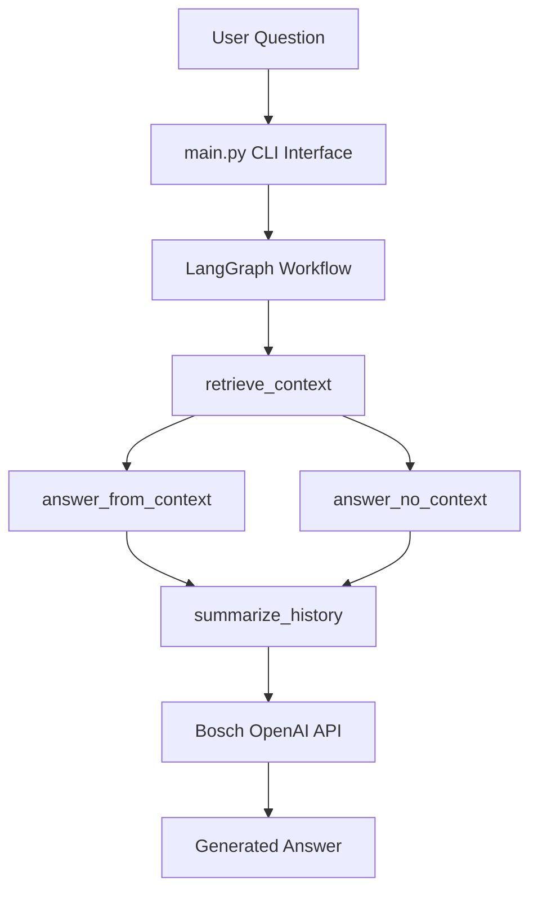

# Transcript Chatbot using LangGraph

A conversational chatbot that answers questions from a course transcript stored in a DOCX file.

The chatbot uses LangGraph for workflow orchestration, LangChain utilities for document retrieval, and a Bosch OpenAI-compatible API endpoint for generating responses.

---

# Features

- Question answering from transcript documents
- Retrieval-Augmented Generation (RAG)
- LangGraph-based agent workflow
- Conversation summarization for token efficiency
- Conditional routing when no context is found
- Displays retrieved transcript evidence
- Uses Bosch internal OpenAI-compatible API

---

## Architecture Overview

---

# How It Works

A. Document Loading

  The transcript DOCX file is loaded using Docx2txtLoader.

B. Text Splitting

  Large transcripts are split into smaller chunks using RecursiveCharacterTextSplitter.
  
  This improves retrieval performance.

C. Vectorization

  Chunks are indexed using TFIDFRetriever.
  
  This converts transcript text into numerical vectors for similarity search.

D. Query Retrieval

  When a user asks a question:
  
  - The retriever searches transcript chunks
  - The most relevant chunks are selected
  - The context is passed to the LLM

E. Answer Generation

  The Bosch AI API receives:
  
  - system instructions
  - retrieved transcript context
  - conversation summary
  - recent messages

  The model generates the final response.

F. Conversation Memory

  Older messages are periodically summarized to:

  - reduce token usage
  - maintain conversation context

---

## LangGraph Workflow

---

# Installation

Clone the repository:

- git clone "repo-url"

- cd transcript-chatbot

Install dependencies:

- pip install -r requirements.txt

---

# Environment Variables

Set your Bosch API key:

GENAIPLATFORM_FARM_SUBSCRIPTION_KEY=your_api_key_here

Example for Linux / Mac:

export GENAIPLATFORM_FARM_SUBSCRIPTION_KEY=your_key

Example for Windows:

set GENAIPLATFORM_FARM_SUBSCRIPTION_KEY=your_key

---

# Running the Chatbot

Start the chatbot:

python main.py

---

# Key Components

main.py  
CLI interface and runtime loop

loader.py  
Loads and splits transcript

retriever.py  
Builds TF-IDF retriever

graph_builder.py  
LangGraph workflow

bosch_client.py  
Bosch API integration

config.py  
Configuration parameters

---
